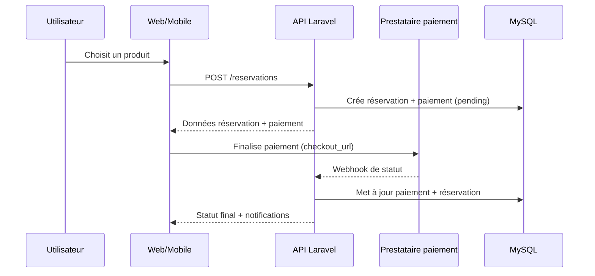
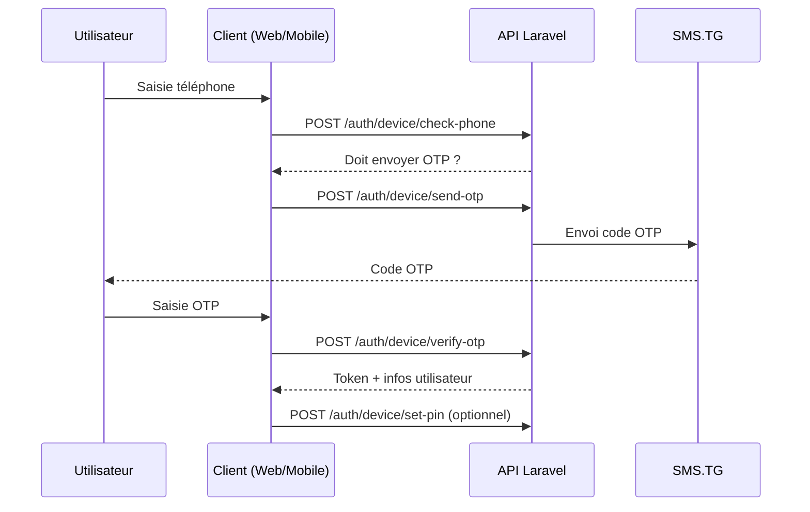
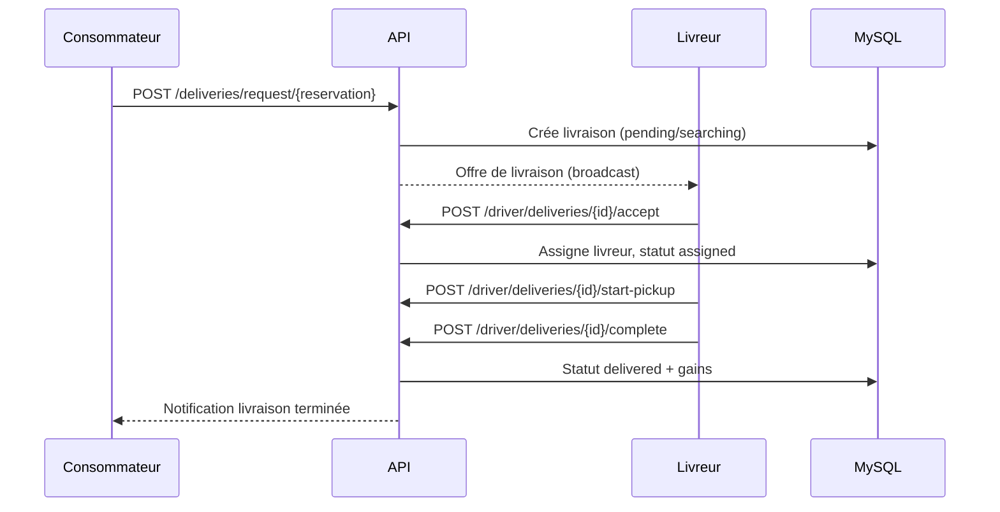

# Architecture technique globale

## Vue d’ensemble
Le projet est un monorepo organisé en trois applications principales :
- **Backend** : API REST Laravel (PHP 8.2+, Laravel ^12).
- **Frontend Web** : Vue 3 + Vite + TypeScript + Tailwind.
- **Mobile** : Expo / React Native + Redux Toolkit.

## Schéma d’architecture (système)
```mermaid
flowchart LR
  subgraph Clients
    Web[Frontend Web
Vue 3 + Vite]
    Mobile[App Mobile
Expo / React Native]
  end

  subgraph Backend
    API[API Laravel
JWT + Services]
    Queue[Jobs/Queue]
  end

  DB[(MySQL 8)]
  Search[(Meilisearch)]
  Storage[(Storage fichiers)]
  Push[Notifications
Expo + WebPush]
  SMS[SMS.TG (OTP)]
  Payments[PayGate / CinetPay / Paystack / FedaPay]
  Realtime[Pusher / Broadcast]
  Geo[Geocoding]

  Web -->|HTTPS JSON| API
  Mobile -->|HTTPS JSON| API

  API --> DB
  API --> Search
  API --> Storage
  API --> Push
  API --> SMS
  API --> Payments
  API --> Realtime
  API --> Geo
  Queue --> DB
```

## Flux métier principaux

### Réservation + paiement


### Authentification téléphone / OTP / PIN


### Livraison (côté consommateur et livreur)


## Communication & données
- **HTTP JSON** : clients → API.
- **JWT** : authentification côté API.
- **Broadcast/Pusher** : notifications temps réel (si activé).
- **WebPush / Expo** : notifications push web/mobile.
- **Meilisearch** : recherche full‑text.

## Points de vigilance d’architecture
- Coexistence de deux flux d’auth (legacy email + nouveau phone/device).
- Certaines migrations sont en `.disabled` (non appliquées en prod).
- Services externes multiples pour paiements → besoin d’une config propre par environnement.
