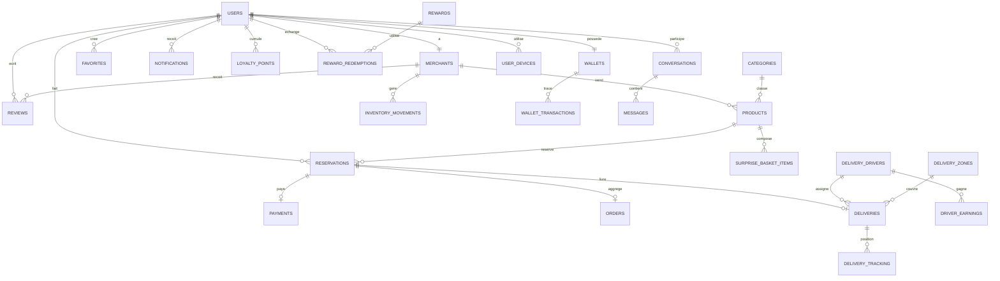

# Modèle de données (MySQL)

## Vue d’ensemble
Le modèle couvre : utilisateurs multi‑rôles, produits, réservations, paiements, wallet, fidélité, livraison, messagerie, notifications et analytics.

## Diagramme ER (simplifié)

## Tables principales (résumé)
- **users** : identités + rôle + téléphone + PIN + préférences notification.
- **merchants** : profil commerçant, géoloc, horaires, vérification.
- **categories** : catégories de produits.
- **products** : prix, stock, date d’expiration, panier surprise.
- **reservations** : quantité, statut, paiement, dates de retrait.
- **payments** : provider, status, checkout_url, référence.
- **wallets** + **wallet_transactions** : solde et historique.
- **loyalty_points**, **rewards**, **reward_redemptions** : fidélité.
- **deliveries**, **delivery_drivers**, **delivery_tracking** : livraison.
- **conversations**, **messages** : messagerie.
- **notifications** : notifications utilisateur.
- **admin_audit_logs** : traces actions admin.

## Statuts clés (exemples)
- **Reservation.status** : pending, confirmed, ready, completed, cancelled, rejected (selon endpoints).
- **Payment.status** : pending, success, failed, cancelled, expired (provider‑dependent).
- **Delivery.status** : pending, searching, assigned, picking_up, picked_up, delivering, delivered, cancelled, failed.

## Notes techniques
- Des migrations sont en `.disabled` → non appliquées automatiquement.
- Le fichier `backend/database/migrations` reste la référence du schéma.
